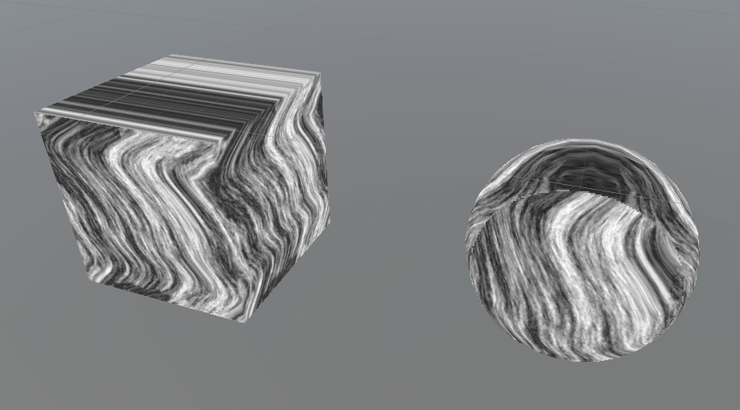
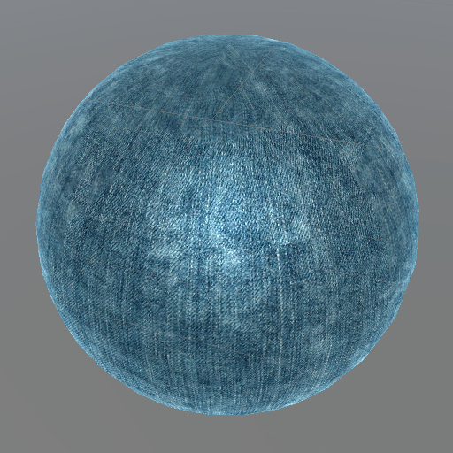

# URP_BlanitShaderLab

- Unity version: 2021.3.13f1c1

### Shaders

| Name          | Description                              | Preview                                                      |
| ------------- | ---------------------------------------- | ------------------------------------------------------------ |
|               |                                          |                                                              |
|               |                                          |                                                              |
| Common_LerpXZ | xz方向采样插值，可以在四周混合采样2d贴图 |  |
|               |                                          |                                                              |
| Env_Cloth01   | 简易布料材质，rim+inner light            |  |
|               |                                          |                                                              |
|               |                                          |                                                              |
|               |                                          |                                                              |
|               |                                          |                                                              |

### Script Tools

- 主要文件位于：[/Assets/Scripts/Tools](https://github.com/blanit/URP_BlanitShaderLab/tree/main/Assets/Scripts/Tools)

| Name           | Description                                         | Preview                                                      |
| -------------- | --------------------------------------------------- | ------------------------------------------------------------ |
| NoiseGenerator | 噪声生成器 兼容2D与3D噪声 输出为asset格式 |  |
|                |                                                     |                                                              |
|                |                                                     |                                                              |

